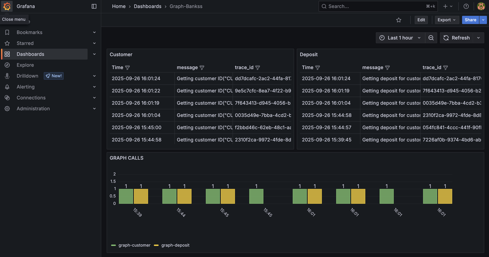

# GRAPH-BANK

## Introduction

This Project is a simplified Demo for Federated GraphQL in use of Apollo RoverCLI.

It considers two subgraphs:

* Customer
* Deposit

linked as a Supergraph based on the relation: a Customer owns a Deposit.

I reused my project: https://github.com/oxide-byte/rust-observability to add some Observability on the different modules.

A sample for Backend CRUD (Query + Mutation + Subscription) and frontend implementation in Leptos can be found at: https://github.com/oxide-byte/rust-berlin-leptos (it uses a Juniper/Axum backend). After this experience, I prefer the async-graphql framework.

## Diagram


## Apollo RoverCLI

The implementation of the Super-Graph is based on Apollo RoverCLI. When you like to use it follow the installation guide:

https://www.apollographql.com/docs/rover/getting-started

and an account: 

https://studio.apollographql.com

I follow currently only the Free Developer subscription but consider the pricing policy on your date, as it could change:

https://www.apollographql.com/pricing

## Dockerized

The project includes a docker-compose.yml that builds the Rust modules and runs the following components:

* graph-customer
* graph-deposit
* loki
* promtail
* prometheus
* grafana

The RoverCLI managed router is not included in docker-compose because it requires credentials from your Apollo account.

## RoverCLI

Starting SuperGraph with RoverCLI:

```shell
rover dev --supergraph-config supergraph.yaml
```

Note: rover dev is intended for local development only and is not production-ready. A production deployment strategy should be evaluated case by case.

## Application Links

When docker-compose and the RoverCLI are running, your environment exposes the following ports:

* http://127.0.0.1:8080/           : graph-customer service
* http://127.0.0.1:8080/graphiql   : graph-customer GraphiQL Interface
* http://127.0.0.1:8080/playground : graph-customer Playground Interface
* http://127.0.0.1:8081/           : graph-deposit service
* http://127.0.0.1:8081/graphiql   : graph-deposit GraphiQL Interface
* http://127.0.0.1:8081/playground : graph-deposit Playground Interface
* http://127.0.0.1:4000/           : RoverCLI SuperGraph service
* http://127.0.0.1:3000/           : Grafana Dashboard (admin/admin)
* http://127.0.0.1:9090/           : Prometheus

## Quickstart

1. Start the subgraphs and observability stack:
   
   docker compose up --build

2. Start the supergraph router (in a separate terminal):
   
   rover dev --supergraph-config supergraph.yaml

3. Run sample queries:
   
   - See http/customer-query.http
   - See http/deposit-query.http
   - See http/super-graph-query.http

## Introspect Graphs

We can introspect the Graphs by different ways.

With RoverCLI:

Customer:

```shell
rover subgraph introspect http://localhost:8080
```

Deposit:

```shell
rover subgraph introspect http://localhost:8081
```

With a HTTP Request:

```
curl -X POST --location "http://127.0.0.1:8080" \
    -H "Content-Type: application/json" \
    -d '{"query":"{ _service { sdl } }"}'
```

With http://127.0.0.1:4000/ on Schema Diff:


## Querying

The subgraphs can be queried individually. If you use a JetBrains tool, you can use the sample requests under the /http folder.

Here some transformed curl samples:

For Customer:
```
curl -X POST --location "http://127.0.0.1:8080" \
    -H "Content-Type: application/json" \
    -d '{"query":"{ customer(id: \"CUSTOMER_1\") {id name }} "}'
```
For Deposit:
```
curl -X POST --location "http://127.0.0.1:8081" \
    -H "Content-Type: application/json" \
    -d '{"query":"{ deposit(id: \"DEPOSIT_1\") { id name }}"}'
```

The request for the SuperGraph, linking the data together:
```
curl -X POST --location "http://127.0.0.1:4000" \
    -H "Content-Type: application/json" \
    -d '{"query":"{ customer(id: \"CUSTOMER_1\") {id name deposit { id name }}}"}'
```

or you could use http://127.0.0.1:4000/ Explorer:


In Grafana, we could see in a simplified table the different requests entering: http://127.0.0.1:3000/



## Some Parts Highlighted

The creation of the Supergraph is configured in supergraph.yaml. The customer and deposit subgraphs are discovered via the URLs defined in the configuration:

```yaml
federation_version: 2
subgraphs:

  customer:
    routing_url: http://127.0.0.1:8080
    schema:
      subgraph_url: http://127.0.0.1:8080

  deposit:
    routing_url: http://127.0.0.1:8081
    schema:
      subgraph_url: http://127.0.0.1:8081
```

The customer is the common component in the SuperGraph. It is declared in graph-customer:

```rust
#[derive(SimpleObject)]
pub struct Customer {
    pub id: ID,
    pub name: String,
}
```

without notification of a deposit. 

The deposit has also a Customer configuration:

```rust
pub struct Customer {
    pub id: ID,
}

#[Object(extends)]
impl Customer {
    #[graphql(external)]
    async fn id(&self) -> &ID {
        &self.id
    }

    async fn deposit(&self) -> Option<Deposit> {
        ...
    }
}
```

In the deposit subgraph, the customer type contains only the customer id and is defined as Object(extends). The self.id provides the customer ID and is used to look up a related deposit. The #[graphql(external)] marks the id as coming from the base Customer defined in the other subgraph, enabling federation to link them.

## External Links

* https://async-graphql.github.io/async-graphql/en/index.html
* https://www.apollographql.com/docs/rover
* https://www.apollographql.com/docs/graphos/schema-design
* https://specs.apollo.dev/

## Open Points

* Correlation/Tracing IDs across the supergraph and subgraphs to follow a request end-to-end and analyze its impact.
* Production readiness: rover dev is for development only; a production router/deployment approach needs to be defined (e.g., Apollo Router) and documented. Consider cloud targets like AWS AppSync where applicable.
* Error handling: add patterns for surfacing and aggregating errors across subgraphs.

GraphQL are nice to see, but not to take light footed. The impact on problems like N+1, deepness, and incorrect usage of the API in overfetching could have a major business impact on your IT infrastructure.  

## Alternative

An alternative to https://www.apollographql.com/ can be found under:
https://the-guild.dev/ but not explored currently.